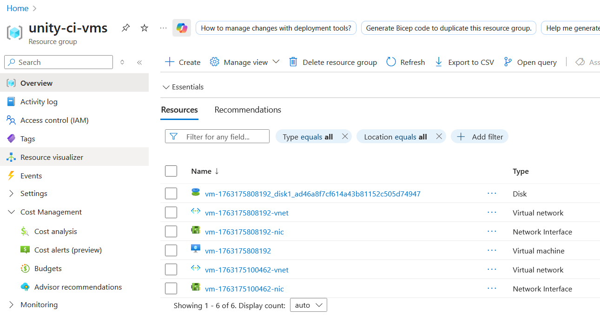
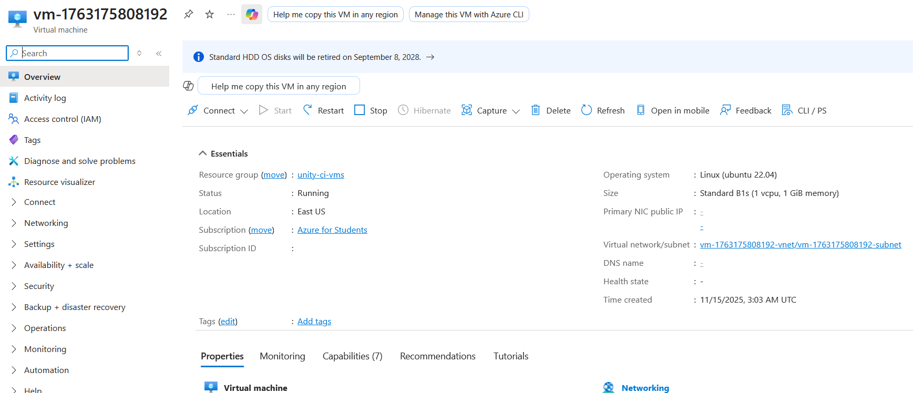
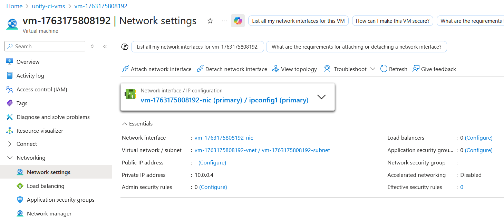

# Phase 2: VM Creation Testing Results

## Overview
End-to-end testing of Azure VM provisioning functionality implemented in Issue #3.

## Test Information

**Date:** November 15, 2025  
**Tester:** Jindo Kim  
**Environment:** Local development (Azure Functions Core Tools)  
**Azure Subscription:** Azure for Students  
**Region:** East US

## Test Execution

### Setup
```bash
npx func start
```

### Test Steps
1. Navigate to `http://localhost:7071/api/function-setup`
2. Monitor console output
3. Verify resources in Azure Portal

## Test Results

### ✅ VM Creation Success

**VM Details:**
- VM Name: `vm-1763175808192`
- Status: Running
- VM Size: Standard_B1s (1 vCPU, 1 GiB RAM)
- OS Image: Ubuntu Server 22.04 LTS (Canonical)
- Disk Type: Standard_LRS (HDD)

### ✅ Network Resources

**Virtual Network:**
- Name: `vm-1763175808192-vnet`
- Address Space: 10.0.0.0/16

**Subnet:**
- Name: `vm-1763175808192-subnet`
- Address Prefix: 10.0.0.0/24

**Network Interface:**
- Name: `vm-1763175808192-nic`
- Private IP: 10.0.0.4

**Disk:**
- Name: `vm-1763175808192_disk1_ad46a8f7cf614a43b81152c505d74947`
- Type: Standard HDD LRS
- Size: 30 GiB

### ✅ Resource Group
- Name: `unity-ci-vms`
- Location: East US
- Total Resources: 6 (VM, VNet, 2 NICs, 2 Disks from multiple test runs)

## Console Output
```
[2025-11-15T03:03:28.195Z] Creating VM: vm-1763175808192
[2025-11-15T03:03:28.197Z] Using subscription: 2faf0e7b-616e-44d6-aea9-7b54f0664d84
[2025-11-15T03:03:28.204Z] Checking resource group: unity-ci-vms
[2025-11-15T03:03:30.897Z] Resource group unity-ci-vms already exists
[2025-11-15T03:03:30.899Z] Resource group ready
[2025-11-15T03:03:30.901Z] Creating virtual network...
[2025-11-15T03:03:53.615Z] Virtual network created (23 seconds)
[2025-11-15T03:03:53.616Z] Creating network interface...
[2025-11-15T03:03:53.988Z] Network interface created (0.4 seconds)
[2025-11-15T03:03:53.989Z] Network resources ready
[2025-11-15T03:03:53.991Z] Creating virtual machine...
[2025-11-15T03:04:09.641Z] Virtual machine created: vm-1763175808192 (16 seconds)
[2025-11-15T03:04:09.643Z] VM creation completed successfully
```

**Total Provisioning Time:** ~41 seconds

## Performance Metrics

| Resource | Creation Time |
|----------|---------------|
| Resource Group | < 1s (already existed) |
| Virtual Network | 23s |
| Network Interface | 0.4s |
| Virtual Machine | 16s |
| **Total** | **~41s** |

## Azure Portal Screenshots

### Resource Group Overview


### VM Overview


### Network Configuration


## Issues & Observations

### ⚠️ Warning: Async Execution
```
Warning: Unexpected call to 'log' on the context object after function execution has completed.
```

**Cause:** `provisionVM()` called without `await` in `index.js`  
**Impact:** None on functionality, VM still creates successfully  
**Resolution:** To be addressed in future optimization (not blocking)

### ✅ No Authentication Errors
- DefaultAzureCredential worked seamlessly
- Azure CLI token recognized automatically

### ✅ No Quota Issues
- Standard_B1s VM size within quota limits
- No resource limitations encountered

## Acceptance Criteria Verification

- [x] VM successfully created and visible in Azure Portal
- [x] VM reaches "Running" status
- [x] No authentication or permission errors
- [x] Resource group contains all expected resources (VNet, Subnet, NIC, Disk)
- [x] All resources created in correct region (East US)
- [x] VM configuration matches specifications (Ubuntu 22.04, Standard_B1s)

## Resource Cleanup

All test resources successfully deleted:
- Resource Group: `unity-ci-vms` (deleted)
- VM: `vm-1763175808192` (deleted)
- Network resources: VNet, NICs (deleted)
- Disks: All managed disks (deleted)

**Method:** Azure Portal - Delete Resource Group

**Verification:** Resource group no longer visible in Azure Portal

## Conclusion

Phase 2 VM creation functionality is **fully operational**. All acceptance criteria met. Ready to proceed to Phase 3 (Public IP and noVNC installation).

---

**Tested by:** Jindo Kim  
**GitHub Issue:** #4  
**Related PR:** #7